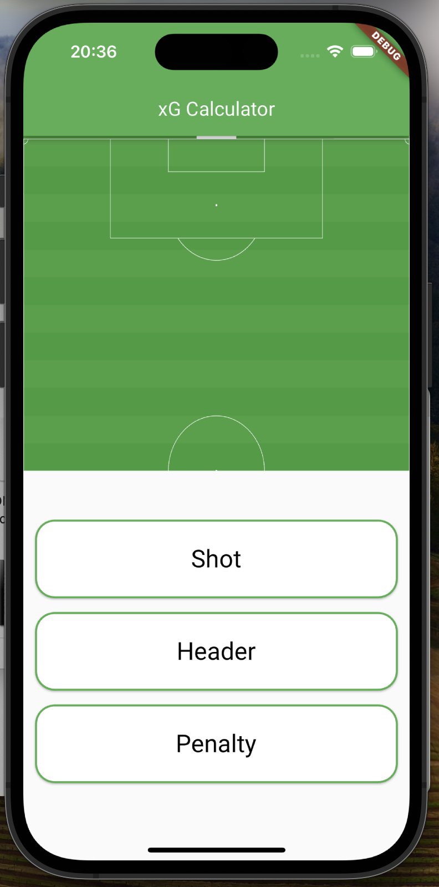
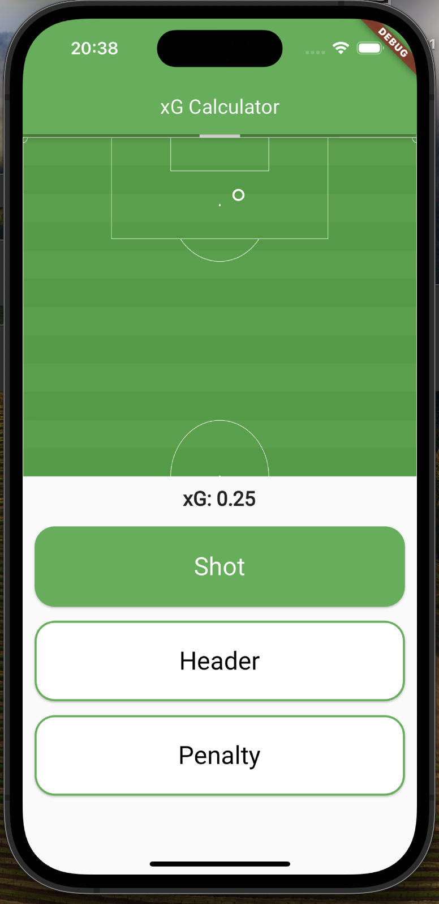
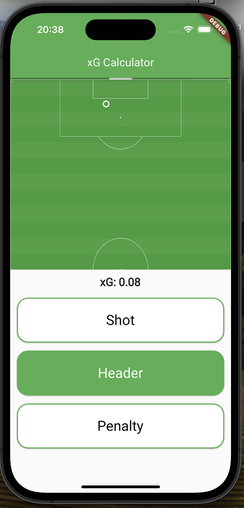
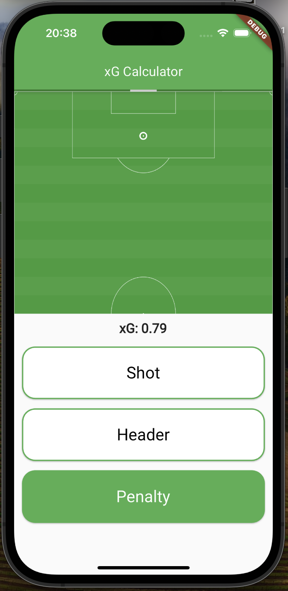

# xG Calculator App

## Overview
The xG Calculator app is designed to provide soccer enthusiasts with a tool to compute the Expected Goals (xG) for any given soccer shot. Expected Goals is a statistical metric that quantifies the likelihood of a shot resulting in a goal based on various factors such as shot type and shot location on the field.

## Features
- **Shot Type Selection**: Choose from different shot types including Shot, Header, and Penalty.
- **Location Input**: Specify the shot location on the field using an intuitive interface.
- **xG Calculation**: Instantly calculate the Expected Goals value based on the chosen shot type and location.

## Screenshots

## Video

## Getting Started
To get started with the xG Calculator app, follow these steps:
1. **Download and Install**: Install Flutter if you do not have it installed already.
2. **Connect Your Phone**: Connect your phone to your computer.
3. **Run**: From the command line, cd into to project and run `flutter run`.
4. **Input Shot Details**: Select the shot type and specify the shot location.

## Feedback
We welcome your feedback to improve the xG Calculator app. If you have any suggestions, encounter issues, or want to request new features, please contact us at [oskaratlimagnusson@gmail.com](mailto:oskaratlimagnusson@gmail.com).

## Privacy Policy
Your privacy is important to us. The xG Calculator app does not collect or store any personal data. Location data is only used for shot location input within the app and is not stored or transmitted elsewhere. For more information, read our [Privacy Policy](privacyPolicy.md)

## Support
For support inquiries or technical assistance, please email us at [oskaratlimagnusson@gmail.com](mailto:oskaratlimagnusson@gmail.com).

## Credits
- Developed by: Oskar Magnusson
